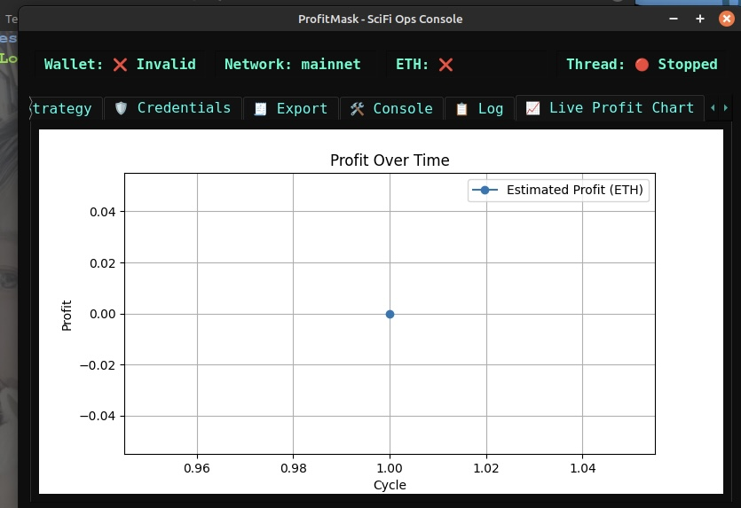
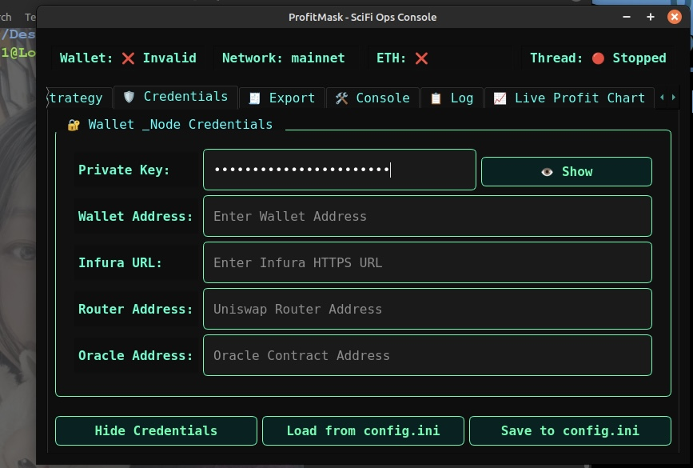
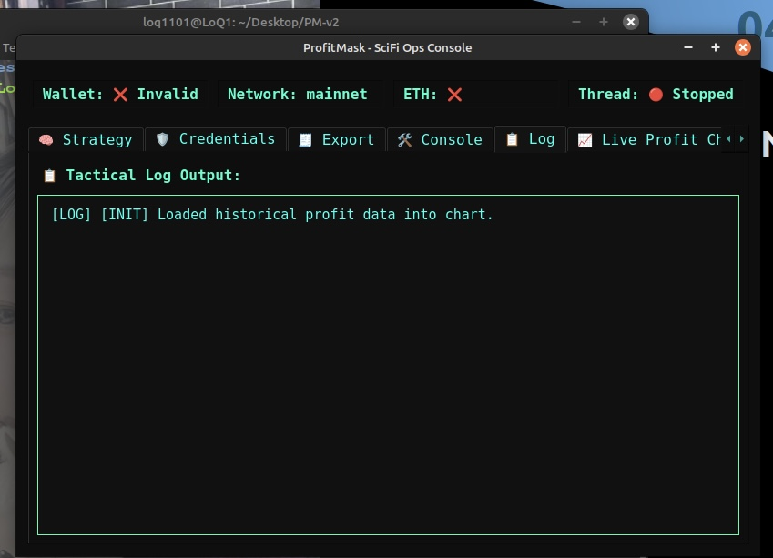

# Profit-Mask v2: Decentralized Trading Terminal

**Profit-Mask v2** is a production-grade, GUI-based trading terminal for decentralized markets. Built for real execution using a MetaMask-compatible wallet, it integrates Uniswap, Chainlink, live strategy switching, SQLite logging, and dynamic backtesting capabilities — all within a sci-fi inspired dashboard.

---

## Features

- **Sci-Fi PyQt5 GUI**: Modular tabbed layout with tactical real-time state display
- **Live Execution Engine**: Real ERC-20 swaps via ABI-encoded RPC; no `web3.py` dependency in swap logic
- **Dynamic Strategy Modes**:
  - `signal`: z-score + slope pattern detection
  - `profit`: delta arbitrage using oracle valuations
- **Wallet Validation**: Auto-checksum, ETH/token balance, and key mismatch warnings
- **Chainlink Oracle Support**: TTL-cached fair price evaluation for risk-aware trading
- **Threaded Controller**: Graceful loop management with export checkpoints
- **Live Profit Charting**: Cycle-by-cycle ETH delta plotting
- **Export System**: Auto/manual export of `trades`, `signals`, and `profits` as CSV/JSON
- **GUI-Driven Configuration**: Override and persist any field from the interface
- **Full Logging**: SQLite-backed tracking + console debug with embedded console

---

## Interface Preview

**Real-Time Profit Chart**  


**Wallet Credentials**  


**Console Log Output**  


---

## Project Structure

```
Profit-Mask/
├── core/                 # Backend engine and strategy logic
│   ├── controller.py     # TradingThread lifecycle + logging
│   ├── strategy.py       # Signal and profit scan logic
│   ├── wallet.py         # Private key + address validation + balance check
│   ├── oracle.py         # TTL-cached Chainlink interface
│   ├── utils.py          # Web3 interface, gas/quote logic, router TX
│   └── logging.py
├── interface/            # GUI system and styling
│   ├── gui.py            # SciFiGUI widget + tab system
│   ├── styles.py         # StyleSheet for GUI
│   └── dashboard.py      # Live update callback system
├── config/               # Configuration and ABI contracts
│   ├── config.ini
│   ├── runtime_config.ini
│   └── abi/
│       ├── erc20.abi.json
│       └── uniswap_router.abi.json
├── data/                 # Persistent SQLite logs
│   └── trading_log.db
├── logs/                 # Rolling log output
│   └── activity.log
├── main_gui.py           # Application launcher
├── requirements.txt
└── README.md
```

---

## Setup Instructions

### 1. Install Dependencies

```bash
pip install -r requirements.txt
```

### 2. Launch the Application

```bash
python main_gui.py
```

---

## Configuration Management

- `config/config.ini`: Default static settings (wallet, RPC, token)
- `runtime_config.ini`: Overwritten at runtime by GUI input
- `config/abi/`: Required ABI files for ERC-20 and UniswapV3 routers

---

## Logging & Export

- **Database**: `data/trading_log.db` (auto-created)
  - `trades`: swap execution logs
  - `signals`: signal decision logs
  - `profits`: cycle-based delta logging
- **Export**:
  - **Automatic**: Every N cycles (configurable in GUI)
  - **Manual**: Export tab supports JSON/CSV per table
- **GUI Debug Console**: Embedded window with real-time log streaming

---

## Major Enhancements Over v1

- Modular file structure with clear roles
- Live ETH/token balance validation
- Strategy-manager decoupled from GUI input
- TTL-cached price fetches to reduce RPC load
- Signal mode enhanced with statistical heuristics
- Fully abstracted config override + GUI save/load
- Auto export checkpoints + full cycle tracking
- Hardened trade logging, fallback protection, and reconnect handling

---

## License

BSD 3-Clause License  
Copyright (c) 2025, Profit-Mask Contributors  
All rights reserved.
